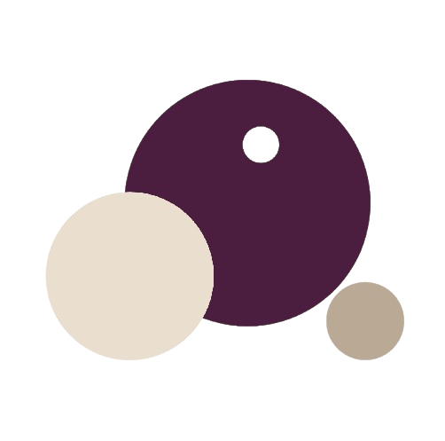

#  Omnya Peptide

A mobile protocol tracker for iOS and Android built for women managing peptides, glow blends, and GLP-1 wellness routines.

Existing trackers record what went in. Omnya Peptide tracks what came out, designed as a calm wellness product rather than a laboratory tool.

## Project Structure

This monorepo contains the Flutter mobile client and the Node.js Fastify backend synchronization API:

```text
peptide/
├── apps/
│   ├── mobile/             # Flutter mobile app (iOS & Android)
│   │   ├── assets/         # Bundled offline fonts (Fraunces & Instrument Sans) & images
│   │   ├── lib/
│   │   │   ├── core/       # Colors, typography, glass components, buttons, toast
│   │   │   ├── data/       # Local storage, models, repositories, API sync client
│   │   │   ├── domain/     # Reconstitution dilution math and outcome correlation
│   │   │   └── ui/         # Onboarding, Today, Progress, Stack, Circle, Photo Read
│   │   └── test/           # Unit, widget, and integration tests
│   └── server/             # Fastify TypeScript server (deployed on Render)
│       ├── src/            # Auth, data sync, circles, and webhooks
│       └── supabase/       # PostgreSQL schema & production RLS policies
└── README.md
```

## Production Infrastructure

- **Mobile Client**: Flutter 3.44+, offline-first architecture with automatic background sync to Supabase and Render.
- **Backend API**: Node.js Fastify service hosted on Render at `https://omnya-peptide.onrender.com`.
  - Health check: `GET /health`
  - Automated 24/7 uptime monitoring supported via UptimeRobot.
- **Database & Auth**: Supabase PostgreSQL with strict Row Level Security (RLS) policies scoped per-user via anonymous JWT authentication (`auth.uid()`).

## Design System

- **Tone**: Warm minimal, comfortable to open in public.
- **Explicit constraints**: No clinical blue, no needles or syringes, no chemical formulas, no neon accents on black, no all-caps labels.
- **Palette**:
  - Cream (`#FDFBF7`): Main canvas
  - Sand (`#F4EFEA`): Card surfaces
  - Taupe (`#B5A496` / `#8C7A6B`): Outlines and labels
  - Plum (`#4A1E35` / `#361325`): Primary actions and accents
  - Charcoal (`#1F1D1C`): Text and dark mode surface
- **Typography**:
  - Headlines, numbers, and milestones: **Fraunces** (bundled offline TTF, serif with tabular numbers)
  - Body, tags, and controls: **Instrument Sans** (bundled offline TTF, humanist sans)
- **Interaction details**:
  - Tactile button compression (`scale 0.96`) with light haptic feedback.
  - Horizontal sliding route transitions on non-root screens.
  - Optical liquid glass surfaces with backdrop blur.
  - Linear icons from `hugeicons`.

## Core Screens

### Today
- **Next Dose Card**: Shows scheduled compound, dose, site rotation, and a one-tap log action.
- **Daily Check-in**: Three taps for energy, appetite, and optional photo in under 10 seconds.
- **Weekly Insight**: Contextual note flagging normal cycle water retention (*"Scale is up 2 lb, period is due Thursday. Ignore it."*).

### Progress
- **Before/After Slider**: Drag to compare baseline with current photo.
- **Weight and Cycle Band**: Plots weight curve against shaded cycle phases to contextualize water weight.
- **Plain-English Correlation**: Directly ties adherence to visible changes (*"Since GHK-Cu started: +14% skin brightness, 3 weeks"*).
- **Social Export**: Generates 9:16 progress cards for Instagram and TikTok stories.

### Stack
- **Inventory**: Shows compounds, runout dates, cadence, and monthly spend ($312/month).
- **Reconstitution Calculator**: Volumetric dilution tool calculating insulin syringe units (U-100 and U-40).

### Circle
- **Private Cohort**: Invite-only accountability group capped at 5 members with unique 5-character personal invite codes.
- **Consistency Only**: Displays check-in streaks (*"4 of 5 checked in today"*). Weight metrics are hidden by default.

### Weekly Photo Read
- **Ghost Camera**: Overlays previous week's capture with adjustable opacity to match framing and lighting.
- **Honest Deltas**: Tracks face fullness, skin evenness, and waistline trends in plain English without fake praise.

## App Store Compliance and Privacy

Because most peptides are not FDA-approved, the app follows strict App Store guidelines:
- No vendor links or sourcing information anywhere in the app.
- The reconstitution calculator is framed strictly as a mathematical dilution tool.
- The user enters their own compounds and doses; the app never prescribes dosing.
- Photos remain strictly in an on-device vault and are never uploaded without explicit export.
- **No account required to start**: Users immediately start tracking anonymously without creating an account or providing an email.

## Getting Started

### Prerequisites
- Flutter SDK 3.44+
- Node.js 20+

### Mobile App
```bash
cd apps/mobile
flutter pub get
flutter run
```

To build a release Android APK (automatically loads `IMGBB_API_KEY` from `apps/mobile/.env`):
```bash
cd apps/mobile
./build_apk.sh
```
Or manually with `--dart-define`:
```bash
cd apps/mobile
flutter build apk --release --dart-define=IMGBB_API_KEY="your_api_key_here"
```

### Backend Server
```bash
cd apps/server
cp .env.example .env # Fill in your SUPABASE_URL and SUPABASE_ANON_KEY
npm install
npm run build
npm start
```

Default local port is 3000. Health check endpoint is at `GET /health`.

## Verification & Testing

### Mobile
```bash
cd apps/mobile
flutter analyze
flutter test
```

### Server
```bash
cd apps/server
npm run build
npm test
```
